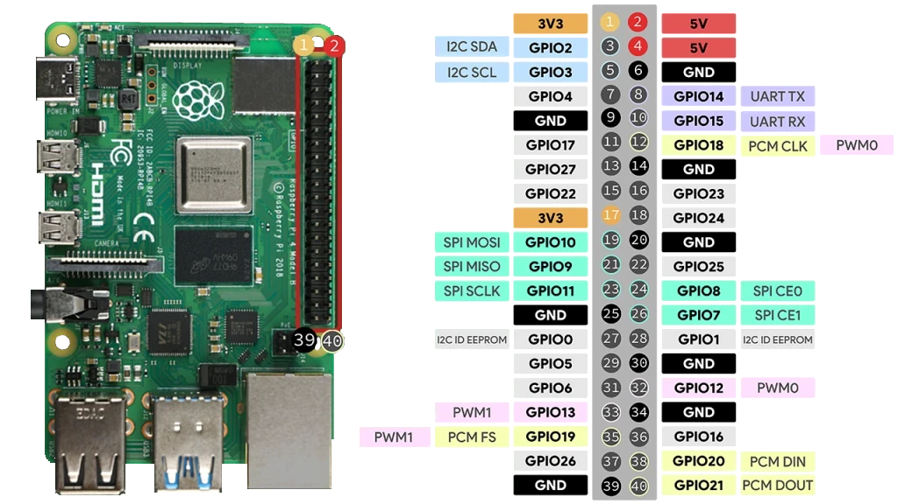
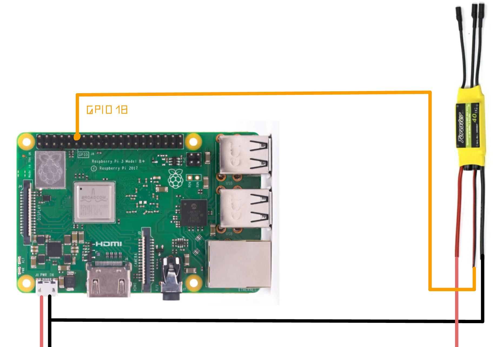

# pi-esc

<div align="center">
    
</div>

<br />

<div align="center">
    
    <br />
    <a href="https://randomnerdtutorials.com/raspberry-pi-pwm-python/">
        Source of image
    </a>
</div>

<br />

## Introduction

This simple example controlls a brushless motor via an electronic speed controller (ESC).
You can controll the throttle using an the left joystick on any controller as long as the inputs are being read correctly using `jstest`. 

<div align="center">
    
    <p>
        Connect <b>GPIO 18</b> to your ESC and make sure both have a <b>common ground</b>
    </p>
    <br />
</div>

### Enable PWM

> Please take a look at the pi4j [documentation](https://www.pi4j.com/documentation/io-examples/pwm/) for further information.

Edit the config file with sudo permission:

`sudo vim /boot/firmware/config.txt`

At the bottom, you will need to add / edit the following lines.
Don't get confused with the `#` which indicates that the last line is a comment - It is supposed to be that way.

```toml
...

[all]
dtoverlay=pwm
# GPIO 18 = channel 0
```

### Install joystick 

The joystick inputs are being parsed from the `jstest` output.
If not already present, install and validate it using the following commands:

```bash
sudo apt-get install -y joystick

# To validate that your input can be read correctly, execute
jstest /dev/input/js0
```

In case you can't controll the throttle using the left joystick, you might need to edit the mapping in `ControllerInput`.
